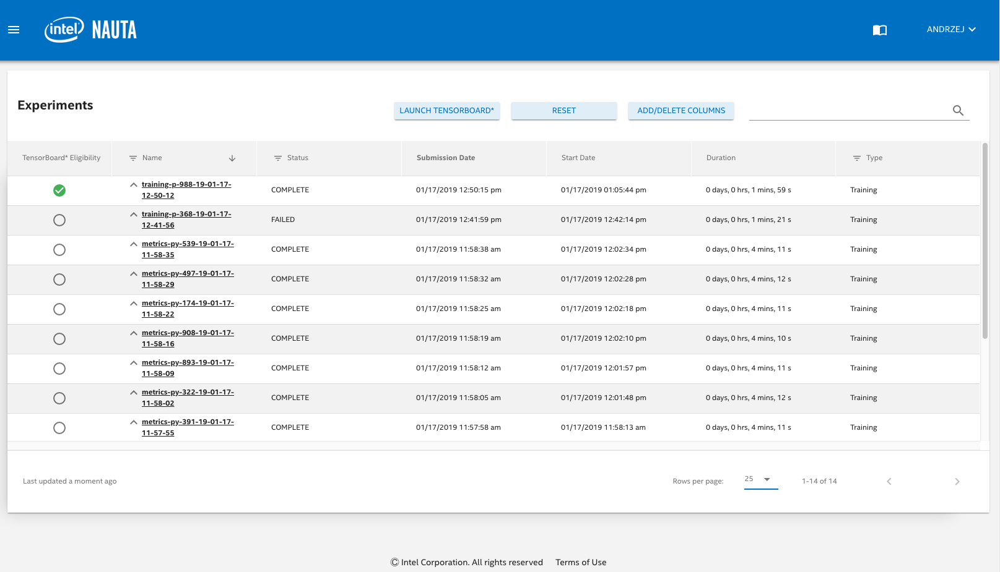
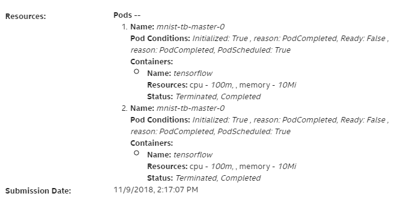
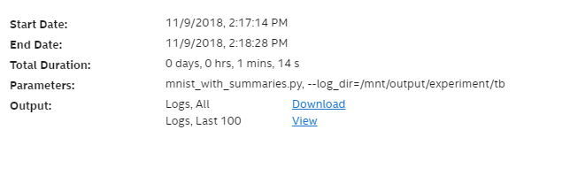

# Viewing Experiment Results from the Web UI

The web UI lets you explore the experiments you have submitted. To view your experiments at the web UI, enter the following command at the command prompt:

`$ nctl launch webui`

The following screen displays (this is an example only).

 

* **Name**: The left-most column lists the experiments by name.
* **Status**: This column reveals experiment’s current status, one of: `QUEUED, RUNNING, COMPLETE, CANCELED, FAILED, CREATING`.
* **Submission Date**: This column gives the submission date in the format: MM/DD/YYYY, hour:min:second AM/PM.
* **Start Date**: This column shows the experiment start date in the format: MM/DD/YYYY, hour:min:second AM/PM.  The Start Date (or time) will always be after the Submission Date (or time).
* **Duration**: This column shows the duration of execution for this experiment in days, hours, minutes and seconds.
* **Type**: Experiment Type can be Training, Jupyter, or Inference. Training indicates that the experiment was launched from the CLI. Jupyter indicates that the experiment was launched using Jupyter Notebook. Inference means that training is largely complete and you have begun running predictions (inference) with this model.

You can perform the tasks discussed below at the Nauta web UI.

## Expand Experiment Details

Click on a _listed experiment name_ to see additional details for that experiment.  The following details are examples only. 

This screen is divided into two frames. The left-side frame shows:

* **Resources** assigned to that experiment, specifically the assigned pods and their status and container information including the CPU and memory resources assigned.

* The **Submission Date** and time.

See the following figure, Details 1

 

The right-side frame of the experiment details windows shows:
* **Start Date**: The day and time this experiment was launched. 
* **End date**: The day and time this experiment was launched. 
*	**Total Duration**: The actual duration this experiment was instantiated.
*	**Parameters**: The experiment script file name and the log directory.
* **Output**: Clickable links to download all logs and view the last 100 log entries. 

See the following figure, Details 2
 

## Searching on Experiments

In the **Search** field at the far right of the UI , enter a string of alphanumeric characters to match the 
experiment name or other parameters (such as user), and list only those matching experiments. This Search function lets the user search fields in the entire list, not just the experiment name or parameters. 

## Adding/Deleting Columns

Click **ADD/DELETE COLUMNS** to open a dialogue. Here, the columns currently in use are listed first with 
their check box checked. Scroll down to see more, available columns listed next, unchecked. Click to check and 
uncheck and select the column headings you prefer. Optional column headings include parameters such as Pods, 
End Date, Owner, Template, Time in Queue, etc.

Column headings also include metrics that have been setup using the Metrics API, for a given experiment, and you 
can select to show those metrics in this display as well.

Column additions and deletions you make are retained between logins.

Refer to [Launching TensorBoard to View Experiments](view_exp_tensorbd.png).

## Launching Kubernetes Dashboard

Click the hamburger menu  at the far left of the UI to open a left frame. Click **Resources Dashboard** to open the Kubernetes resources dashboard. Refer to [Accessing the Kubernetes Resource Dashboard](accessing_kubernetes.md).
